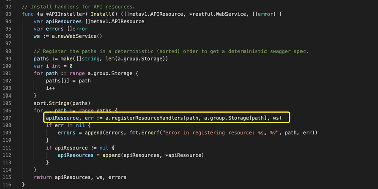

# API Server API Group

This paper studies the source code of the  **API Group** section. You should read the source code at the same time. It can enhance your design capacity.

## Resource Management

### Storage

VersionedResourcesStorageMap saves the mapping of version-&gt;resources-&gt;rest.Storage, the first-level mapping is the version, the second-level is the resource, and the storage is used to solve the creation, modification, and deletion of resource objects.

## Install on API Server

### getResourceNamesForGroup

### APIGroupVersion

### Install APIGroup

#### InstallREST

### APIInstaller

#### Install

#### registerResourceHandlers

Convert the rest.Storage interface to various operation interfaces, the code is shown below. It can be seen from this that the rest.Storage interface is the key, and we will discuss it in depth later.

Take creater as an example. Finally, register creater or namedCreater on the Post method.

### Discovery

In the registration code, we can see that when registering the API, available Resources and restful.WebService is returned. Afterward, immediately register the Resources available to the WebService on the root request of the WebService, and the action is GET.

