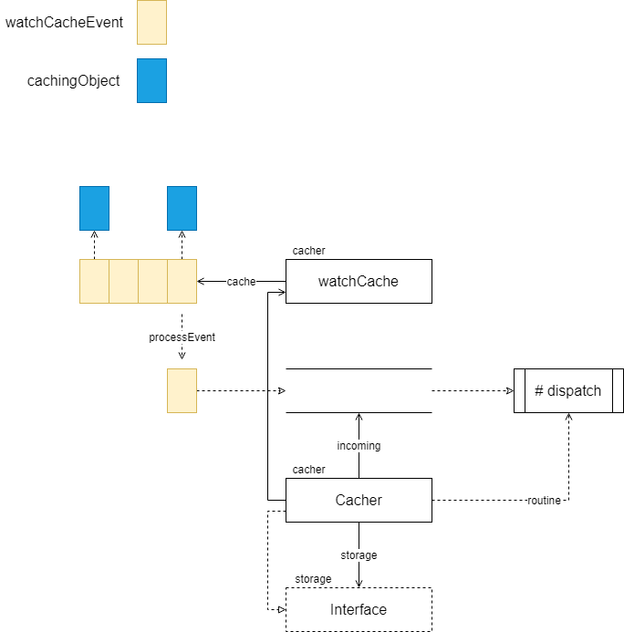
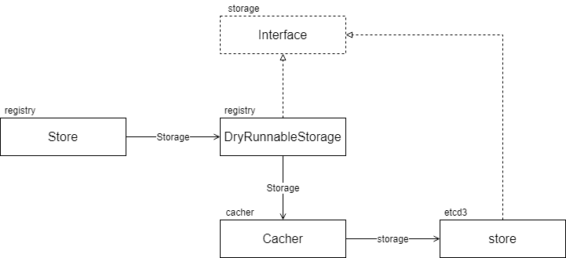
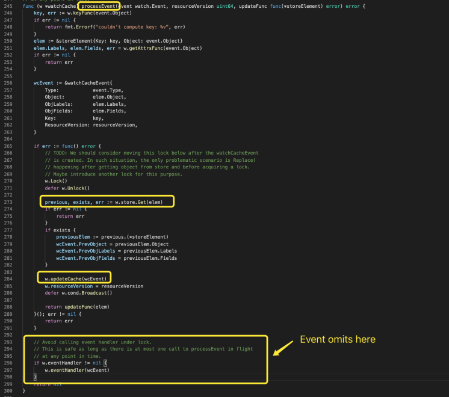
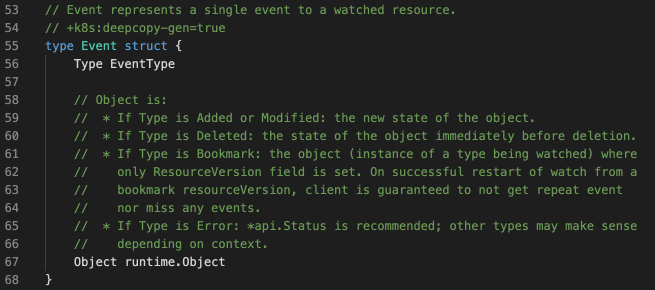
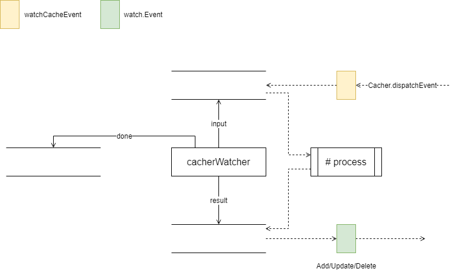
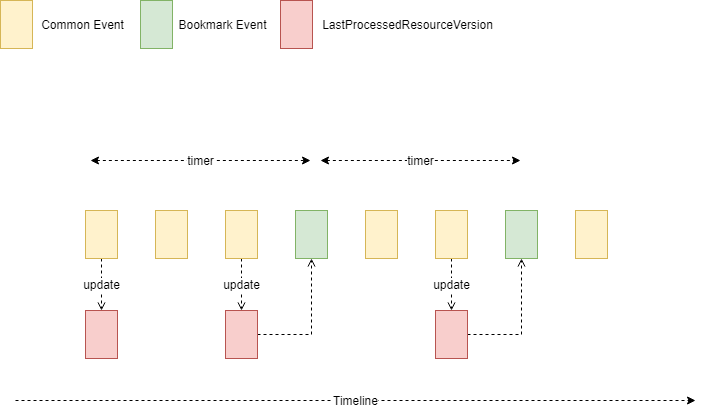
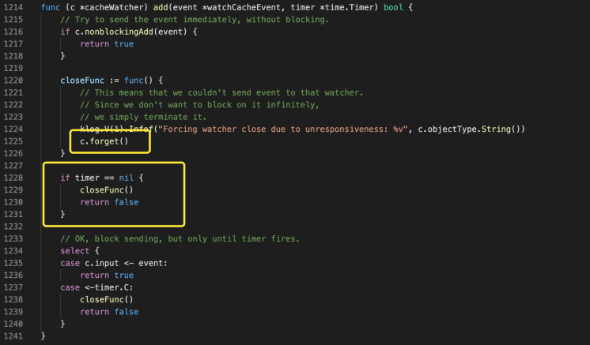

# API Server Cacher

This paper studies the source code of the Storage section. You should read the source code at the same time. It can enhance your design capacity. 

## Overview

Cacher contains an instance of storage.Interface, which is a real storage backend instance. At the same time, Cacher also implements storage.Interface interface, which is a typical **decorator pattern**. There are a large number of elegant **design patterns** in the Kubernetes source code, so you can pay more attention when reading. After simply tracking the code, the current guessed relationship is as follows.

The registry package location is as follows.

The storage package location is as follows.

‌Store initialization code set DryRunnableStorage location.

## Store

### Interface Definition

The Store interface is defined in k8s.io/client-go. Pay attention to the Add/Update/Delete in the interface, which is used to add objects to the Store. Then the role of this interface is the glue between API Server and Etcd.

## Event Main Cycle

The Cacher structure is defined as follows, which contains a watchCache instance.

Look at the Cacher initialization method again. Line 373 is used to create a watchCache instance. The EventHandler passed in is a method of Cacher. In this way, watchCache has a channel for injecting events into Cacher.

The dispatchEvents method in the above code seems to be the part that processes the Event sent from the watchCache method. Let's continue, it seems that we are about to solve the event source problem.

Keep track of incoming, so does processEvent seem familiar?

Go to the watchCache structure and find the place where eventHandler is used.

Continue to dig, so far, we have found the complete source of the event, and **there are only three types of events**: Add/Update/Delete.

### watchCache.processEvent

The generation of the original event to the final event is shown in the figure below. The keyFunc, getAttrsFunc, Indexer, etc. used are all passed in through configuration.

After the event created, refresh the cache.

## Event Generation

### Cache Watcher

The related structure of cacheWatcher in Cacher is shown in the figure below.

The cacheWatcher implements the watch.Interface interface for monitoring events. The watch.Interface declaration is as follows.

The definition of watch.Event is as follows.

The core processing flow of cacheWatcher is as follows.

### Watch

#### Cacher

The judgment processes of triggerValue and triggerSupported are as follows.

CacheWatcher's Input Channel cache size calculation is as follows.

The specific addition code is as follows

The forgetWatcher is as follows. clean watcher from Cacher.

## Event Dispatching

### Bookmark Event

In the Cacher event distribution process, a Timer is created. Each time this Timer is triggered, it is possible to generate a Bookmark Event event and distribute this event. The source code is as follows.

#### Dispatch

After the Bookmark Event is created, the ResourceVersion information of the event object is updated through Versioner, and then the event is distributed. Next, let's take a look at how to distribute.

The Bookmark Event distribution process is shown in the following figure. You can see that the event has been distributed to all cacheWatchers whose IDs are less than the current time.

After arriving at CacheWatcher, the processing is very simple, just returns the original object.

### General Event

#### Dispatch

As you can see from the figure above, when the length of watchersBuffer is greater than or equal to 3, the object is cached for sending. When sending an event, if there is a failure, get an available time slice, within this time slice, try to block sending the event. If all the transmissions are successful, the waiting time slice is exhausted.

If sending fails within the time slice, delete the remaining cacheWatcher.

## References

* [https://kubernetes.io/docs/reference/using-api/api-concepts/](https://kubernetes.io/docs/reference/using-api/api-concepts/)

