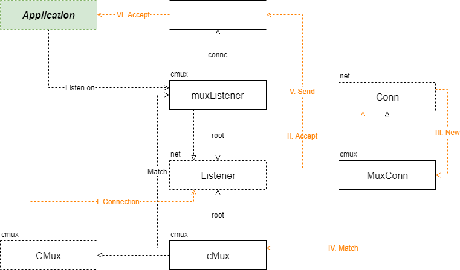
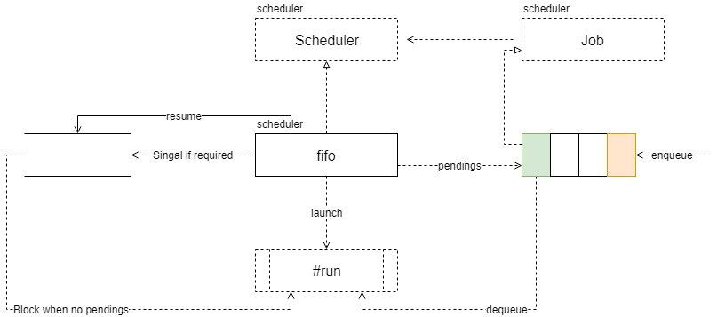
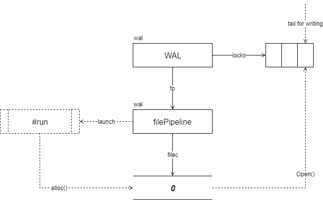

# API Server Etcd

Hello everyone, this time I bring you ETCD source code reading. The three parts of this article are the Server part, the Storage part, and the Utility part. With the source code for further understanding, you can deepen your understanding and enhance related design capabilities.

## Server

### Single

#### Landscape


Clients contain the address to be monitored by the etcd server. The address can be in the form of TCP or Unix Socket and supports http and https. The [serverCtx](https://sourcegraph.com/github.com/etcd-io/etcd@release-3.3/-/blob/embed/serve.go#L46:6) matches a net.Listener and runs independently of a goroutine.

#### Serve Procedure


### Backend

#### Landscape


## Storage

### BoltDB Backend

#### Landscape


**run**

Start Timer regularly submits or submit and exit when receiving the stop signal. The code is simple, as shown below.

```go
func (b *backend) run() {
    defer close(b.donec)
    t := time.NewTimer(b.batchInterval)
    defer t.Stop()
    for {
        select {
        case <-t.C:
        case <-b.stopc:
            b.batchTx.CommitAndStop()
            return
        }
        b.batchTx.Commit()
        t.Reset(b.batchInterval)
    }
}
```

**Transaction Relationship**


**Buffer**


### MVCC

#### Store


**References**

* [ReadView](https://sourcegraph.com/github.com/etcd-io/etcd@release-3.3/-/blob/mvcc/kv.go#L35:6)
* [WriteView](https://sourcegraph.com/github.com/etcd-io/etcd@release-3.3/-/blob/mvcc/kv.go#L63:6)
* [KV](https://sourcegraph.com/github.com/etcd-io/etcd@release-3.3/-/blob/mvcc/kv.go#L100:6)

#### Watchable

**Landscape**


**Watcher Creation**


The ch of all watchers created through watchStream all point to watchStream.ch. The event direction is watcher -&gt; watchStream. Watcher management is in charge of watcherGroup.

**Nofity Waiter**


## Utility

### CMux

* [soheilhy/cmux](https://github.com/soheilhy/cmux): Connection multiplexer for GoLang: serve different services on the same port!

#### Landscape


#### Implementation



### Scheduler

#### Landscape



### WAL

#### Landscape



