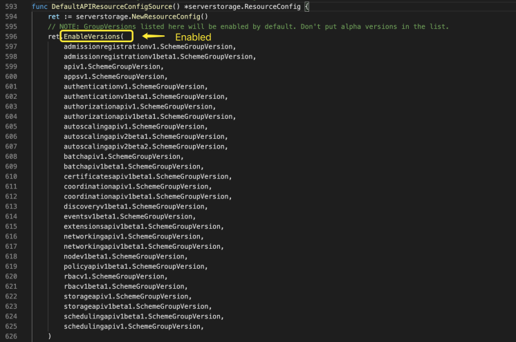
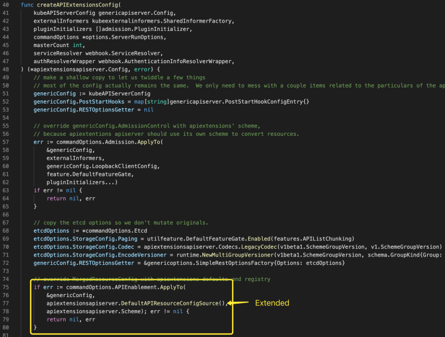
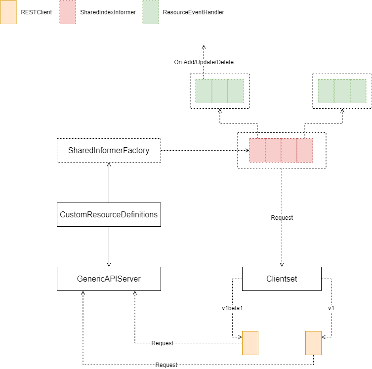
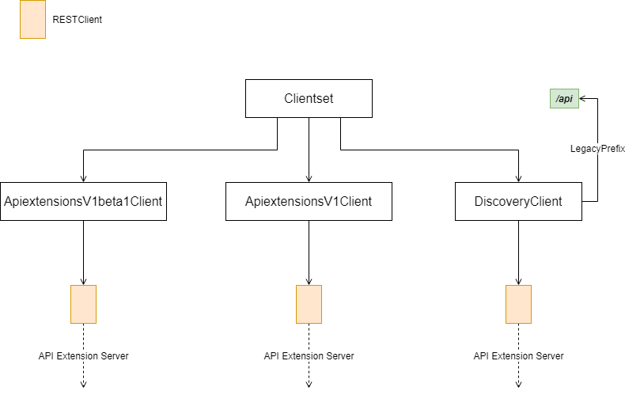
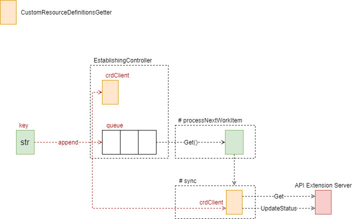
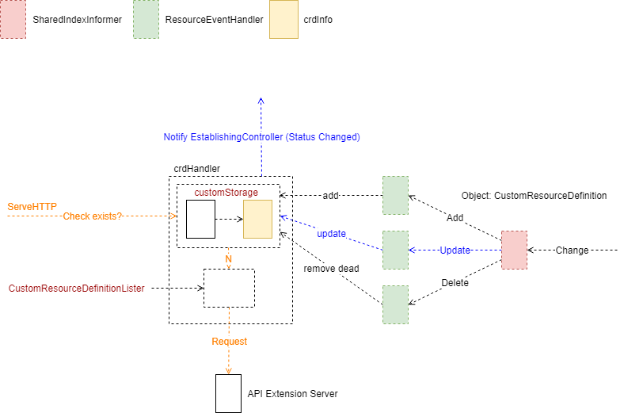
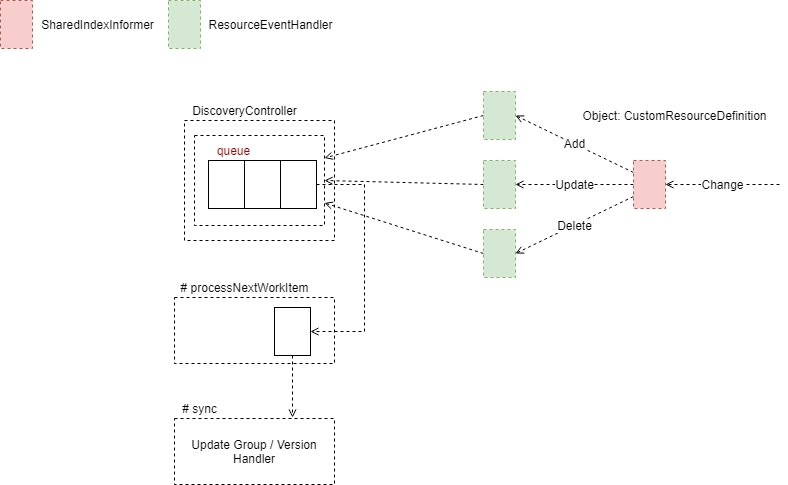

# API Server CustomResourceDefinitions

This article has studied the source code of the CRD part, equipped with the source code for further understanding, which can deepen the understanding and enhance related design capabilities. 

## ResourceConfig

### Default Configuration

Enabled resource configuration and disabled version.

### Extend

Enabled the selection as follows.

## Runtime Support

The three are shown below.

### Storage

#### Custom Resource Definitions

The Store is expanded as shown below.

## State Transition

### Landscape

SharedInformerFactory is used to create SharedIndexInformer, which will periodically use Clientset to connect to the API Extension Services of v1beta1 or v1 and notify the respective ResourceEventHandler after obtaining the status change. Here, there are still some issues that need to dig deeper:

* How SharedInformerFactory distinguishes different types of resource state changes
* Can ResourceEventHandler pay attention to changes in the state of different types of resources at the same time
* How are resource status changes obtained

### Clientset

The Clientset function is relatively simple. It encapsulates the available API Extension Services. Each RESTClient is connected to the "Loopback" address and sends requests to different services.

### SharedInformerFactory

#### Relationship

#### Add Informers

## Management

### EstablishingController

After the EstablishingController is started, it will start a scheduled execution task. This task checks every second whether there is a new **Key** value in the queue. If there is, update the corresponding resource status on the Server side to **Established**.

The sync code is as follows.

### CRD Handler

The CRD Handler registers event processing with SharedIndexInformer. When the Watch object type is Update, it may be that the state changes to the Established state and needs to be sent to the EstablingController.

When the CRD Handler processes the request, it first checks whether the cache contains the requested object, if so, returns the cached object; if not, it requests the Server and changes the cache status. 

### CRD Controller

