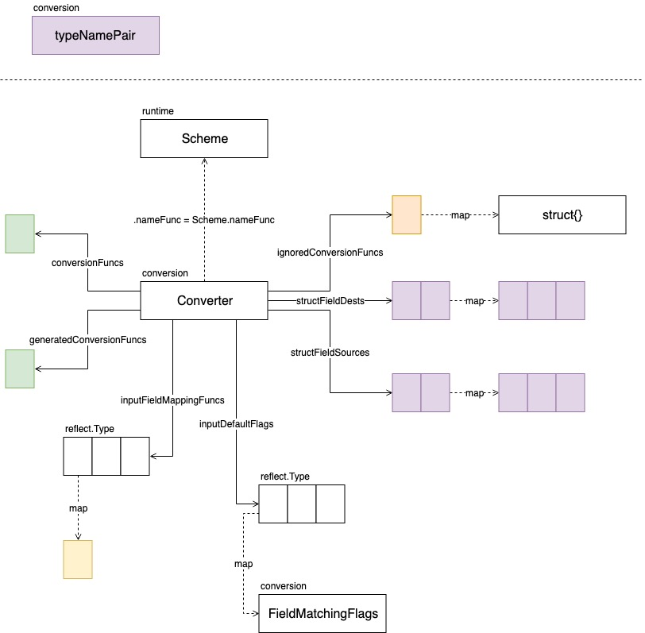
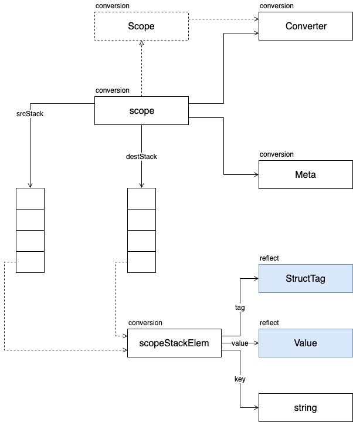

# Core The Basics

## Object

### Overview


The Object instances are as follows. They are basically in the pkg/apis directory, you can find it yourself.


### Unstructured


The scene of Unstructured and Object cooperation is as follows.


The example diagram is as follows.


  


## Scheme

### Builder


### Scheme

Look at the definition of [Scheme](https://sourcegraph.com/github.com/kubernetes/apimachinery@release-1.15/-/blob/pkg/runtime/scheme.go#L47), the first four are maintained the relationship between reflect.Type and Schema.GroupVersionKind. The defaulterFuncs is used to build a default object.

```go
type Scheme struct {
    // versionMap allows one to figure out the go type of an object with
    // the given version and name.
    gvkToType map[schema.GroupVersionKind]reflect.Type

    // typeToGroupVersion allows one to find metadata for a given go object.
    // The reflect.Type we index by should *not* be a pointer.
    typeToGVK map[reflect.Type][]schema.GroupVersionKind

    // unversionedTypes are transformed without conversion in ConvertToVersion.
    unversionedTypes map[reflect.Type]schema.GroupVersionKind

    // unversionedKinds are the names of kinds that can be created in the context of any group
    // or version
    // TODO: resolve the status of unversioned types.
    unversionedKinds map[string]reflect.Type

    // Map from version and resource to the corresponding func to convert
    // resource field labels in that version to internal version.
    fieldLabelConversionFuncs map[schema.GroupVersionKind]FieldLabelConversionFunc

    // defaulterFuncs is an array of interfaces to be called with an object to provide defaulting
    // the provided object must be a pointer.
    defaulterFuncs map[reflect.Type]func(interface{})

    // converter stores all registered conversion functions. It also has
    // default converting behavior.
    converter *conversion.Converter

    // versionPriority is a map of groups to ordered lists of versions for those groups indicating the
    // default priorities of these versions as registered in the scheme
    versionPriority map[string][]string

    // observedVersions keeps track of the order we've seen versions during type registration
    observedVersions []schema.GroupVersion

    // schemeName is the name of this scheme.  If you don't specify a name, the stack of the NewScheme caller will be used.
    // This is useful for error reporting to indicate the origin of the scheme.
    schemeName string
}
```

[FieldLabelConversionFunc](https://sourcegraph.com/github.com/kubernetes/apimachinery@release-1.15/-/blob/pkg/runtime/scheme.go#L89:86) is used to convert label and value to internal label and value.

```go
type FieldLabelConversionFunc func(label, value string) (internalLabel, internalValue string, err error)
```

### AddKnownTypes

[AddKnownTypes](https://sourcegraph.com/github.com/kubernetes/apimachinery@release-1.15/-/blob/pkg/runtime/scheme.go#L172) only needs to pay attention to one problem, that is, the GroupVersionKind is generated from the incoming GroupVersion through the Name method of reflect.Type as the Kind. Please see the simplified sample [Reflect Name Sample](https://gist.github.com/fengyfei/46fe53e3a4ef3eb05cf4402cefabae07). The sample code can be executed under [Go Playground](https://play.golang.org/).


### AddUnversionedTypes

The principle of [AddUnversionedTypes](https://sourcegraph.com/github.com/kubernetes/apimachinery@release-1.15/-/blob/pkg/runtime/scheme.go#L154) is as follows. Unversioned Type can be understood as an Object mounted on a Group, and the Version will never be updated.


### nameFunc

The principle of [nameFunc](https://sourcegraph.com/github.com/kubernetes/apimachinery@release-1.15/-/blob/pkg/runtime/scheme.go#L116) is as follows, just pay attention to the return type priority to Internal Type.


### Others

* [AddTypeDefaultingFunc](https://sourcegraph.com/github.com/kubernetes/apimachinery@1799e75a07195de9460b8ef7300883499f12127b/-/blob/pkg/runtime/scheme.go#L384)
* [Default](https://sourcegraph.com/github.com/kubernetes/apimachinery@1799e75a07195de9460b8ef7300883499f12127b/-/blob/pkg/runtime/scheme.go#L389)
* [ConvertFieldLabel](https://sourcegraph.com/github.com/kubernetes/apimachinery@1799e75a07195de9460b8ef7300883499f12127b/-/blob/pkg/runtime/scheme.go#L472)
* [SetVersionPriority](https://sourcegraph.com/github.com/kubernetes/apimachinery@1799e75a07195de9460b8ef7300883499f12127b/-/blob/pkg/runtime/scheme.go#L620)
* [Name](https://sourcegraph.com/github.com/kubernetes/apimachinery@1799e75a07195de9460b8ef7300883499f12127b/-/blob/pkg/runtime/scheme.go#L748)

## Conversion

### Landscape


The [typePair](https://sourcegraph.com/github.com/kubernetes/apimachinery@release-1.15/-/blob/pkg/conversion/converter.go#L24) is used to represent the combination of source type and target type, [typeNamePair](https://sourcegraph.com/github.com/kubernetes/apimachinery@release-1.15/-/blob/pkg/conversion/converter.go#L29) stores the type and type name. [DefaultNameFunc](https://sourcegraph.com/github.com/kubernetes/apimachinery@release-1.15/-/blob/pkg/conversion/converter.go#L41) is used as the conversion method from the default type to Name. [ConversionFunc](https://sourcegraph.com/github.com/kubernetes/apimachinery@release-1.15/-/blob/pkg/conversion/converter.go#L47:57) defines the object conversion method.

#### Core Function Definitions

The DefaultNameFunc implementation is as follows.

```go
var DefaultNameFunc = func(t reflect.Type) string { return t.Name() }
```

  
The ConversionFunc declaration is as follows.

```go
type ConversionFunc func(a, b interface{}, scope Scope) error
```

  
FieldMappingFunc converts the key to Field in the source structure and the target structure.

```go
type FieldMappingFunc func(key string, sourceTag, destTag reflect.StructTag) (source string, dest string)
```

#### ConversionFuncs


### Converter



  
   
Briefly explain the following methods:

* [RegisterConvesionFunc](https://sourcegraph.com/github.com/kubernetes/apimachinery@release-1.15/-/blob/pkg/conversion/converter.go#L375) calls ConversionFuncs.Add method directly.
* [RegisterUntypedConversionFunc](https://sourcegraph.com/github.com/kubernetes/apimachinery@release-1.15/-/blob/pkg/conversion/converter.go#L389) calls ConversionFuncs.AddUntyped method.
* [RegisterIgnoredConversion](https://sourcegraph.com/github.com/kubernetes/apimachinery@release-1.15/-/blob/pkg/conversion/converter.go#L402) will not do the type of conversion record in the mapping.
* [RegisterInputDefaults](https://sourcegraph.com/github.com/kubernetes/apimachinery@release-1.15/-/blob/pkg/conversion/converter.go#L419) register input type Field conversion method.

#### doConversion

When Converter executes object conversion methods, such as [Convert](https://sourcegraph.com/github.com/kubernetes/apimachinery@release-1.15/-/blob/pkg/conversion/converter.go#L469) and [DefaultConvert](https://sourcegraph.com/github.com/kubernetes/apimachinery@release-1.15/-/blob/pkg/conversion/converter.go#L481), it is allowed to pass in a Meta object and execute the [doConversion](https://sourcegraph.com/github.com/kubernetes/apimachinery@release-1.15/-/blob/pkg/conversion/converter.go#L487) method to construct the scope object in this method.


  


#### Scope



#### defaultConvert

The [defaultConvert](https://sourcegraph.com/github.com/kubernetes/apimachinery@release-1.15/-/blob/pkg/conversion/converter.go#L582) handles the default type conversion, the incoming sv, dv have been ensured to be addressable through [EnforcePtr](https://sourcegraph.com/github.com/kubernetes/apimachinery@release-1.15/-/blob/pkg/conversion/helper.go#L27:6). This part of the code is a nearly perfect application of the reflect package in Go. 

First, deal with the conversion of basic types, which can be converted by [AssignableTo](https://golang.org/pkg/reflect/#pkg-index) or [ConvertibleTo](https://golang.org/pkg/reflect/#pkg-index).

```go
switch st.Kind() {
    case reflect.Map, reflect.Ptr, reflect.Slice, reflect.Interface, reflect.Struct:
    // 这些类型后续处理
    default:
    // This should handle all simple types.
    if st.AssignableTo(dt) {
        dv.Set(sv)
        return nil
    }
    if st.ConvertibleTo(dt) {
        dv.Set(sv.Convert(dt))
        return nil
    }
}
```

Then process them separately according to dv.Kind\(\).

**dv.Kind\(\) -&gt; reflect.Struct**

Return the result of the [convertKV](https://sourcegraph.com/github.com/kubernetes/apimachinery@release-1.15/-/blob/pkg/conversion/converter.go#L788) method directly. However, you need to pay attention to first convert sv and dv into the form of Key/Value respectively. Please study the [toKVValue](https://sourcegraph.com/github.com/kubernetes/apimachinery@release-1.15/-/blob/pkg/conversion/converter.go#L691) method by yourself.

```go
return c.convertKV(toKVValue(sv), toKVValue(dv), scope)
```

**dv.Kind\(\) -&gt; reflect.Slice**

```go
case reflect.Slice:
    if sv.IsNil() {
        // Don't make a zero-length slice.
        dv.Set(reflect.Zero(dt))
        return nil
    }
    dv.Set(reflect.MakeSlice(dt, sv.Len(), sv.Cap()))
    for i := 0; i < sv.Len(); i++ {
        scope.setIndices(i, i)
        if err := c.convert(sv.Index(i), dv.Index(i), scope); err != nil {
            return err
        }
    }
```

**dv.Kind\(\) -&gt; reflect.Ptr**

```go
case reflect.Ptr:
    if sv.IsNil() {
        // Don't copy a nil ptr!
        dv.Set(reflect.Zero(dt))
        return nil
    }
    dv.Set(reflect.New(dt.Elem()))
    switch st.Kind() {
        case reflect.Ptr, reflect.Interface:
        return c.convert(sv.Elem(), dv.Elem(), scope)
        default:
        return c.convert(sv, dv.Elem(), scope)
    }
```

**dv.Kind\(\) -&gt; reflect.Interface**

```go
case reflect.Interface:
    if sv.IsNil() {
        // Don't copy a nil interface!
        dv.Set(reflect.Zero(dt))
        return nil
    }
    tmpdv := reflect.New(sv.Elem().Type()).Elem()
    if err := c.convert(sv.Elem(), tmpdv, scope); err != nil {
        return err
    }
    dv.Set(reflect.ValueOf(tmpdv.Interface()))
    return nil
```

**dv.Kind\(\) -&gt; reflect.Map**

```go
case reflect.Map:
    if sv.IsNil() {
        // Don't copy a nil ptr!
        dv.Set(reflect.Zero(dt))
        return nil
    }
    dv.Set(reflect.MakeMap(dt))
    for _, sk := range sv.MapKeys() {
        dk := reflect.New(dt.Key()).Elem()
        if err := c.convert(sk, dk, scope); err != nil {
            return err
        }
        dkv := reflect.New(dt.Elem()).Elem()
        scope.setKeys(sk.Interface(), dk.Interface())

        if err := c.convert(sv.MapIndex(sk), dkv, scope); err != nil {
            return err
        }
        dv.SetMapIndex(dk, dkv)
    }
```

