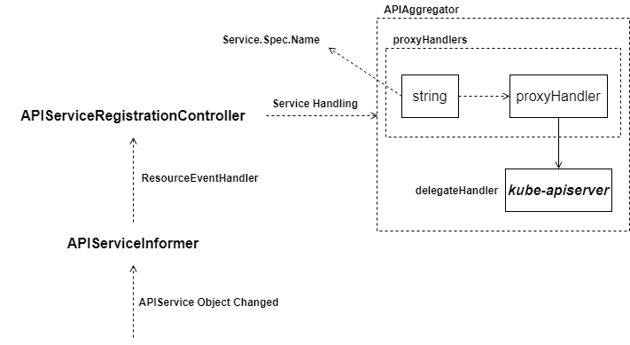
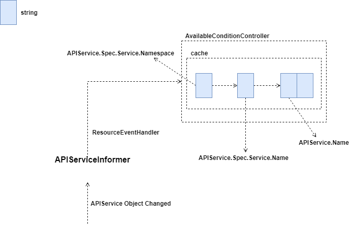

大家好，我是杨鼎睿，这一次给大家带来的是 API Server 的源码阅读。包括之前的 etcd 源码阅读，整个 API Server 共 109 张源码及源码图，文章最后有 API Server 系列目录。欢迎大家的阅读。

本文研究了 Aggregator Server 部分的源码，配备源码进行进一步理解，可以加深理解,增强相关设计能力。

## Service Registration

### Workflow

通过 Informer 监控 APIService 资源变更，通过 ResourceEventHandler 放入 Controller 队列。Controller 内部处理逻辑与其他 Controller 一致，最终将 APIService 资源变更情况，反映至 Aggregator Server 的 HTTP 处理部分。

## Available Condition Controller

### Rebuild Service Cache

- 监听的是 APIService 资源变更
- 无论是 Add/Update/Delete，重建 cache 方法一致，使用的是从 API Server 获取的服务列表

### Change Condition

AvailableConditionController 的运行协程从 queue 中取出内容，并检查该服务状态后，将服务当前上报至 API Server。
