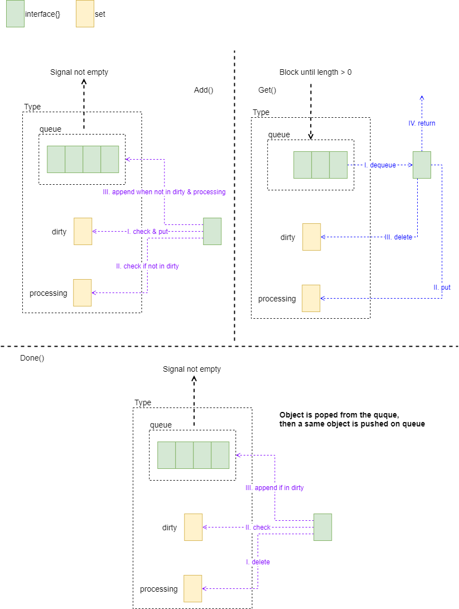
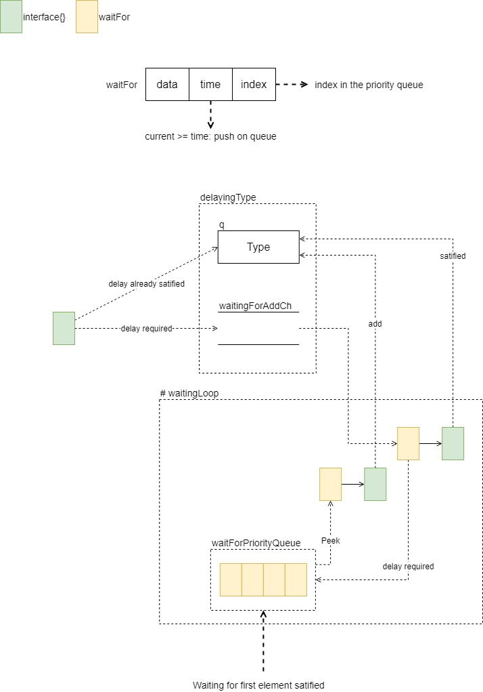
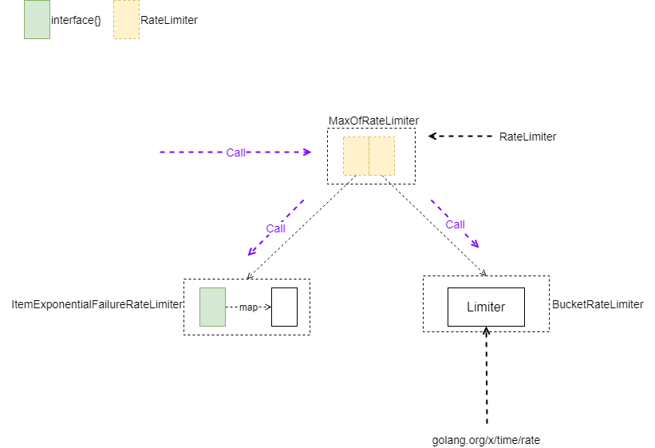

大家好，我是杨鼎睿，这一次给大家带来的是 Controller 的源码阅读。还记得之前的 Shared Informer 吗？Controller 部分的源码设计将会揭开如何使用的面纱。

源码设计图需要配合源码使用，除展示关键设计外，还会有问题性的留白。阅读图的时候发现存在问题的，带着问题去看源码，看别人如何设计解决的，会提高设计能力。

## Design

### RelationShip

### Interface implementation
 通过对上图的分析，可以知道 Type 实例中三个容器的作用如下：

- queue： 保存任意类型实例，其中保存的对象不存在有相同内容的对象在 dirty 或 processing 中
- processing： 对象正在处理中，处理完成后移除
- dirty： 与要添加的对象内容相同的对象正在处理中

### DelayingInterface

- 添加对象时，如果延时条件已达成，直接进入 Queue
- 延时条件未达成，进入 waitForPriorityQueue，其满足 Heap 接口，没进入一个对象，都会以延迟到达的绝对时刻进行重排
- 如果 waitForPriorityQueue 的“最小元素”不满足延时条件，其他不可能满足延时条件

### RateLimiter

- MaxOfRateLimiter 是 RateLimiter 的 Controller，包含了一个 RateLimiter 列表，可填入随意数量的 RateLimiter 具体实现
- MaxOfRateLimiter 本身也是 RateLimiter，其实现方法是使用全部存储的 RateLimiter 分别调用同名方法
- MaxOfRateLimiter 中保存的独立的 RateLimiter 可提供不完整的 RateLimiter 能力，由其他 RateLimiter 补足
