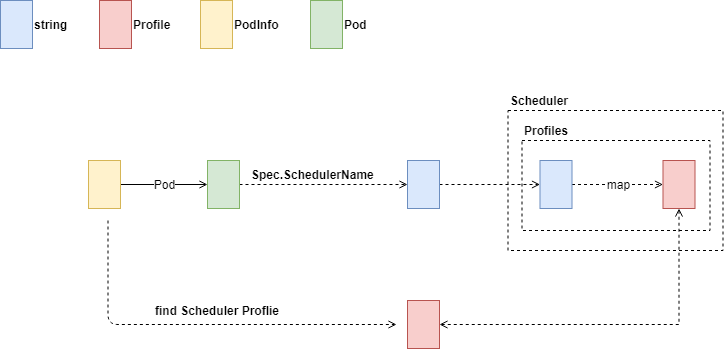
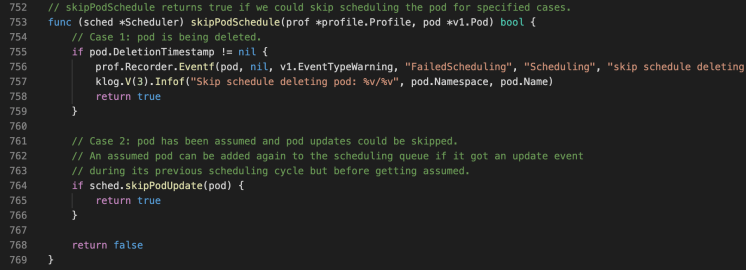
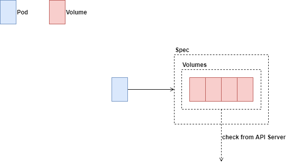
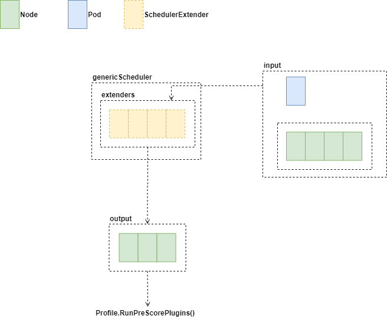
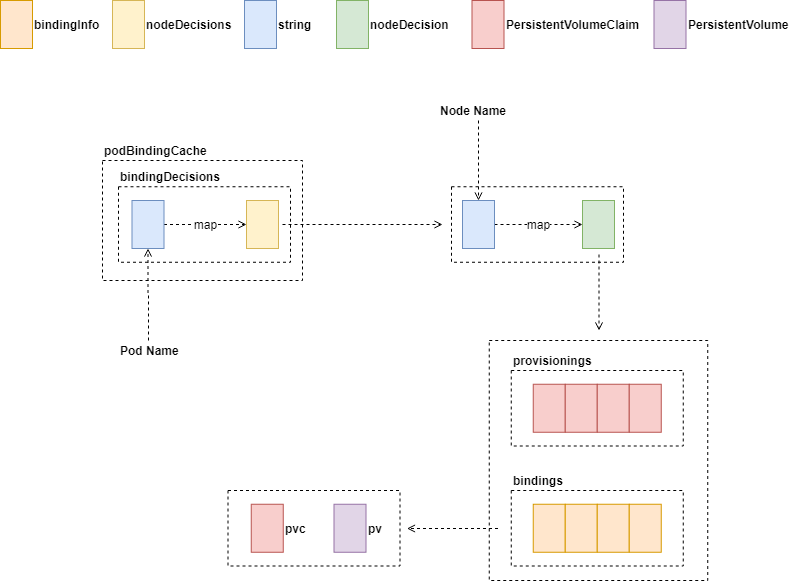

本文研究了 Kubernetes 中 Schedule 部分的源码，配备源码进行进一步理解，可以加深理解,增强相关设计能力。

## Scheduling

### NextPod

Scheduler 中封装了具体调度算法，并与调度算法共享相同的 SchedulingQueue 实例对象。在执行调度时，首先需要通过 NextPod 方法获取待调度的 PodInfo。

### Find Profile for Pod

Profile 中保存着调度框架基本信息。根据选中的当前调度 PodInfo 中的 Pod 实例，选中合适的调度 Profile。根据 Profile、Pod 来判断是否需要跳过当前 Pod 调度，如果判断结果不需要调度当前 Pod，本次调度完成；如果需要调度，则通过 Algorithm 进行调度。

## Algorithm

### Overview

ScheduleAlgorithm 定义了关于调度的两个核心方法，同时，也通过 Extenders 方法预留出了扩展空间。

### Schedule
genericScheduler 实现了 Scheduler 接口，接下来，我们详细看下 genericScheduler 的核心调度方法的实现。

#### Pod Basic Check

#### Run PreFilter

根据 Pod 选择 Profile 后，执行 Profile 的 RunPreFilterPlugins 方法，该方法由 framework 结构提供。执行过程对每个注册的 PreFilterPlugin 接口，执行其 PreFilter 方法，如果执行中有错误发生，那么创建 Status 结构，记录错误信息，并返回，不再执行后续的 PreFilterPlugin 接口。如果全部 PreFilterPlugin 接口都执行成功，返回 nil。Status 结构定义非常简洁，如下

#### Find Nodes Passed Filters

首先根据 Snapshot 中 nodeInfoList 的长度来计算最大 Node 数量，并预先分配 Node 切片。然后根据当前要调度的 NodeInfo，获取其 Node 的名称，在 SchedulingQueue 中查找对应的 Pod。遍历全部 Pod 数组，使用当前 Profile，并执行其 RunPreFilterExtensionAddPod 方法，如果通过，则将该 Pod 存入 Node 中。最后，对 Node 执行 Profile 的 RunFilterPlugins 方法。

#### Find Nodes Passed Extenders

进一步筛选已通过检查的 Node 列表，筛选出满足 SchedulerExtender 要求的 Node 列表。至此，确认了当前调度的 Pod 可选择的 Node 列表。筛选 Node 完成后，使用选中的 Profile 进行 PreScore 操作。

完成 PreScore 操作后，如果仍然存在多于一个可选 Node 的情况，将执行优先级运算，最终根据优先级运算结果经由 selectHost 方法确认要使用的 Host 名称，一次调度过程完成。

## Scheduler Volume Binder

### AssumeCache

### PodBindingCache

本文研究了 Kubernetes 中 Schedule 部分的源码，是 Scheduler 最后一部分。